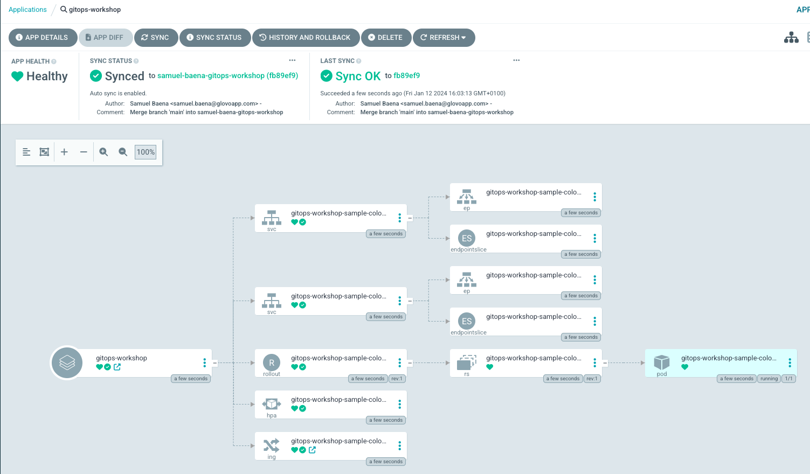
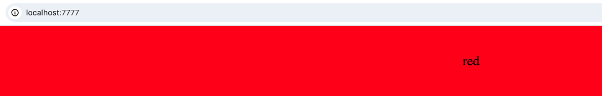
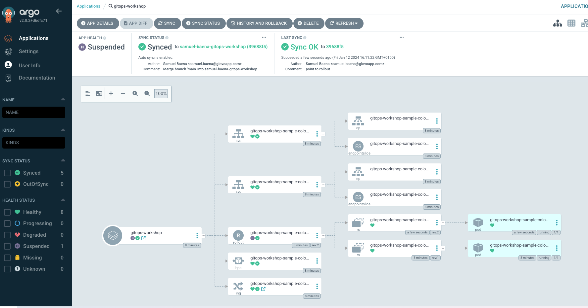
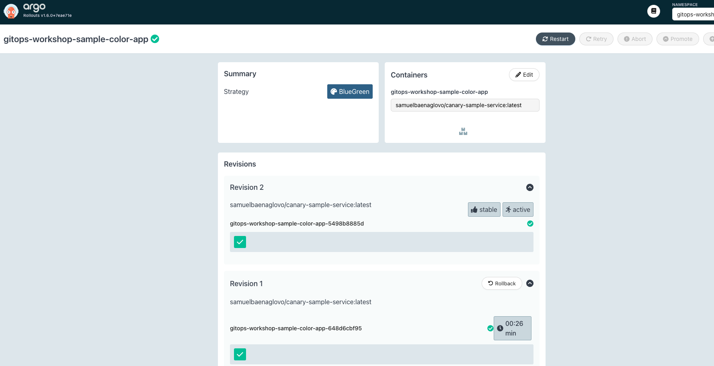
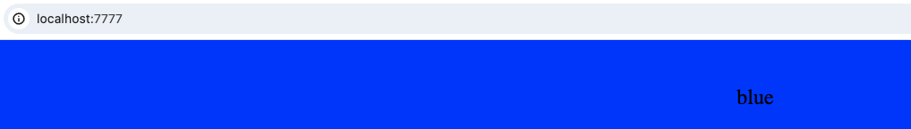
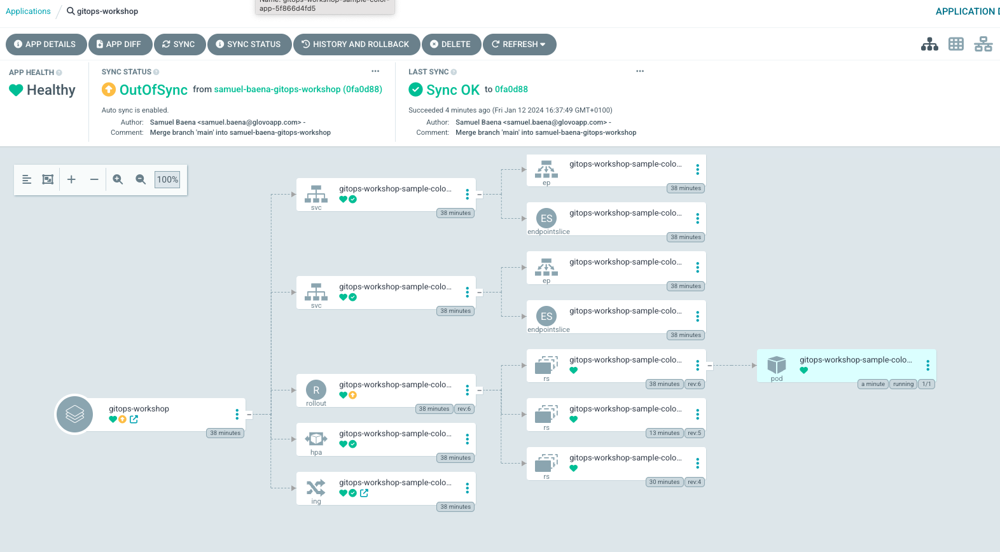
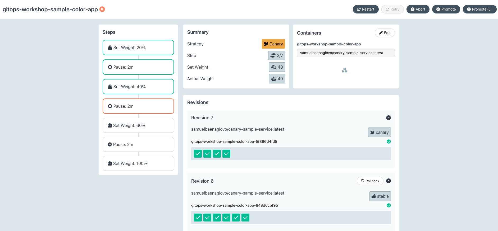

# Gitops Basics Workshop
Welcome to the Gitops Basics Workshop!

Gitops presents a series of changes, challenges and advantages vs a more imperative approach.
In this session we're gonna focus on understanding the following:

* How do we deploy a gitops service
* How does the yaml configuration correlate to resources?
* Rollbacks, promotions, operability
* Canary deployments and how to reduce blast radius

A basic understanding of what gitops means is necessary.
If this is the first time you heard the term, please read the [first two bullet points of the following documentation](https://www.redhat.com/en/topics/devops/what-is-gitops)

**PLEASE REPLACE EVERY INSTANCE OF `braulio` with your name**

## Requirements
This workshop is developed in an OSX operative system. Please notice that some things may change in other OS.

You will need:
* Kubernetes local cluster (You can use k3d, kind or colima for this):

    k3d: (recommende for m1)
    ```
     brew install k3d
     k3d cluster create gitops-workshop -p "7777:80@loadbalancer"
    ```
    Kind: (Check how map ports to host [here](https://kind.sigs.k8s.io/docs/user/ingress))
    ```
     brew install kind
     kind create cluster --name gitops-workshop
    ```
* [kubectl command-line tool installed and configured](https://kubernetes.io/docs/tasks/tools/install-kubectl-macos/)
* [kubectx command-line tool installed and configured](https://github.com/ahmetb/kubectx#homebrew-macos-and-linux)
* Lab Environment Setup
* Clone the workshop repository:

```
git clone https://github.com/Glovo/gitops-basics-workshop.git
cd gitops-basics-workshop
git checkout -b braulio-gitops-workshop
git add . #AFTER YOU HAVE RENAMED EVERY INSTANCE OF `braulio` with your name
git commit -m "Rename placeholder with name"
git push -u origin braulio-gitops-workshop
```

## Tasks
### Task 0 - Setting up ArgoCD + Argo Rollouts
In order to have a Gitops-like deployment, we need a combination of ArgoCD which will track the code for changes and Argo Rollouts which will enable us to have different deployment strategies and options.

We have written a makefile to ease up the local installation of ArgoCD and Argo Rollouts.
Make sure you're connected to your cluster and execute
```
make setup
```

Wait until all pods are up
```
watch kubectl -n argocd get pods
```

Now, in order to track our ArgoCD and Argo Rollouts, you can make the dashboards available by running
```
make dashboard
```

* ArgoCD Dashboard: http://localhost:8888 (Accept unsafe browsing)
  * user: admin
  * password: Execute `kubectl -n argocd get secret argocd-initial-admin-secret -o jsonpath="{.data.password}" | base64 -d`
* Argo Rollouts Dashboard: http://localhost:3100


You may get rid of the port-forward that enables dashboards at any time by running
```
kill $(lsof -t -i :8888)
kill $(lsof -t -i :3100)
```

### Task 1 - Deploying our Gitops configuration
Let's proceed and install a the configuration for our service.
In order to get our service running, we need to understand that there's more than the app itself:
- The application we wanna deploy (In a docker image form)
- The configuration for our application (CPU and Memory, replicas, env vars, secrets...)
- The configuration for the Gitops approach tracking (Repository to track, Helm chart version, target K8S cluster... This information was previously on Spinnaker Dinghyfile)

In this first task we're gonna focus on the third step first.

**REMEMBER TO RENAME EVERY `braulio` IN THE REPO BEFORE PROCEEDING**

1. Install the dependencies
```
kubectl apply -f 01-gitops-dependencies/namespace.yaml
kubectl create -f 01-gitops-dependencies/project.yaml
```
This creates us three resources
- Our working namespace
- Our ArgoCD Project. This is used to limit which namespaces, resources, etc can be modified inside it.

2. Install the gitops application
```
kubectl apply -f 02-gitops-application/application.yaml
```

This is creating our ArgoCD Application, the key piece that will track our service values, let's observe it.

1. Check ArgoCD + Argo Rollouts deployment
A first deployment of the surrounding resources and application will start until eventual completion.
This may include everything you can be familiar with: secrets, the ingress (ALB), the service, the confimaps with configurations...
One that you may not recognise is the Rollout. This is the actual CRD that will create the ReplicaSets and lastly the Pods


When the rollout is in progress, it's time to go to Argo Rollouts to see what is happening.
This is where we will handle all the operations to rollback, promote, etc.
Once our Rollout is complete, we're done with the first task


We recommend that you leave both ArgoCD and Argo Rollouts dashboards open

### Task 2 - Operating our application

Gitops tracks changes on the code to trigger a deployment. Let's modify the CPU and color

### Deploy
1. If your rollout is healthy, you already have your service up and running, visit `localhost:7777` (Or whatever port you mapped your ingress) on your browser

2. Modify your resources.request.cpu from `0.2` to `0.5` and switch from `color: "red"` to `color: "blue"` on `deployment/kubernetes/test/values.yaml`
3. Push the changes to your branch `braulio-gitops-workflow`
4. Observe how ArgoCD picks up the change (may take a couple minutes, you can alternative Hard Refresh to speed it up) and triggers a new deployment on Argo Rollouts


When the pods are stable, a waiting time to downscale the old deployment will happen, then it will stabilise.


Now that the app has been deployed, go back to your `localhost:7777` to see the changed color


### Rollback
Let's say we wanna rollback what we did, how do we do that?
1. In Argo Rollouts, select the previous revision and click on rollback
2. Once you trigger a rollback, Argo Rollouts will scale up those replicas.
3. This will create a drift on the application, that will be the signal for us to either leave the code back on the old version, or release a hot fix for a new one.


Your app should be back to red


### Canary deployments
Now that we know how to deploy and rollback a change, let's get into the world of Canary!
Canary deployments essentially provide us a much finer control of the traffic, allowing for things such as deploying traffic progressively, or split for AB testing.

#### Default behaviour
Our service is currently set in BlueGreen. In order to set the deployment strategy to Canary, let's switch our `values.yaml`
From
```
kind: blueGreen
strategy:
  blueGreen:
    config:
      autoPromotion: true
      autoPromotionSeconds: 30
      scaleDownDelaySeconds: 30
```

To
```
kind: canary
```
We are also gonna scale up our application to 10 pods to see a real difference on the rollout. Also to add in `values.yaml`
```
autoscaling:
  minReplicas: 10
  maxReplicas: 10
```


1. Push your changes and observe what happens on Argo rollouts


  * On the left side you can see the default steps that will happen on a deployment: Set weight of new deploy on 20%, wait for 2 mins, then 40%, wait...
  * In the Summary, you can see the current strategy,the current weight set plus the actual one on the infra (In case we're using a strategy that doesn't allow for a perfect 1to1 match, such as 20% of 3 pods).
  * The rest is pretty much the same as it was

2. Let's deploy a new version of the app by updating the color from `color: "blue"` to `color: "green"`
3. The different steps will happen, now this is important
  * To skip one step, click on Promote
  * To skip the entire canary up to 100%, click on PromoteFull
**THIS ALLOWS FOR A QUICK PROMOTION ON HOTFIXES**

#### Customising steps
When no steps are selected, those are the default ones that happen, but this is completely customisable.
1. Let's set our own steps to migrate 50%, lets add the following to values.yaml
```
strategy:
  canary:
    steps:
      - setWeight: 50
      - pause:
          duration: 30s
      - setWeight: 100
```
2. Push your changes and check Argo Rollouts again
3. You may check a new deployment by changing any resource

#### Custom Headers (**NOT COMPATIBLE WITH WORKSHOP**)
One last case we want to portrait is Custom Headers.
In some cases, instead of progressively redirect traffic you may wanna target something specifically. e.g a country, mobile users...

This features only works with actual traffic with either Istio or ALB Controller as supported systems.
If you have access to those, you can try this section of the workshop. It won't work in local.

Let's pass the new version setting a Custom Header, this way if the app requests with that header, the new version of our application will receive the request.

1. Set our steps to the following:
```
strategy:
  canary:
    steps:
      - setWeight: 10
      - setHeaderRoute:
          name: header-route
          match:
            - headerName: Target-Canary
              headerValue:
                exact: "true"
      - pause: {}
      - setHeaderRoute:
          name: header-route
      - setWeight: 100
```
Due to a limitation with Custom Headers, some traffic must always go to the new version (The initial 10), more on this to be investigated

2. Push your changes and check Argo Rollouts again
3. Here is where things get interesting.
   We have set an indefinite pause, things won't move until we promote the step manually.
   1. Wait until the Custom-Header is active
   2. Curl both endpoints and observe the different returned value
      * Curl the old deployment by running
      ```
      curl http://localhost
      ```
      * Curl the new deployment 10 times by running
      ```
      curl -H "Target-Canary=true" http://localhost
      ```
   3. Promote your app deployment on Argo Rollout
   4. Repeate the same curls. Only one color is returned this time.

Custom Headers allow for more matching configurations, more documentation [here](https://argo-rollouts.readthedocs.io/en/stable/features/traffic-management/#traffic-routing-based-on-a-header-values-for-canary)


## Closing notes
You have arrived to the end of the workshop. Thank you so much for your time and we hope you found it useful.
Feel free to open issues or PRs for doubts and improvements.

You may now delete your local cluster

k3d:
```
k3d cluster delete gitops-workshop
```
Kind:
```
kind delete cluster --name gitops-workshop
```

## License

Copyright © 2024 Glovo

Contents of this repository are licensed under the Apache-2.0 License.
When adding a new commit to this repository and the code is copied from another repository then include the license from the source if is not Apache-2.0 and include a link to the source.